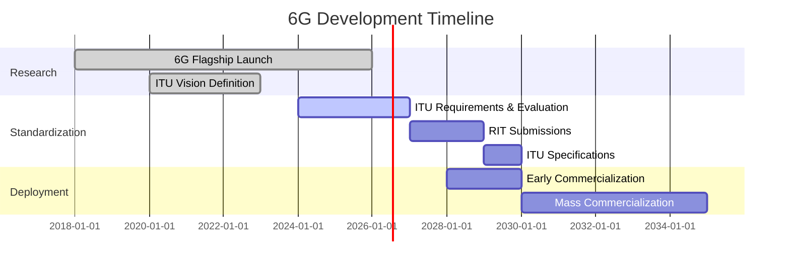

# 6G Wireless Technology - Comprehensive Reference Guide

> A curated collection of 6G research resources, standards, GitHub repositories, academic papers, and industry initiatives for the next generation of wireless communication (IMT-2030).

---

## 📋 Table of Contents

- [Overview](#overview)
- [GitHub Repositories](#github-repositories)
- [Standards Organizations](#standards-organizations)
- [Industry Research \& White Papers](#industry-research--white-papers)
- [Research Consortiums](#research-consortiums)
- [Academic Research](#academic-research)
- [YouTube Channels \& Tutorials](#youtube-channels--tutorials)
- [Spectrum \& Frequency Bands](#spectrum--frequency-bands)
- [Key Technologies](#key-technologies)
- [Timeline](#timeline)

---

## Overview

6G (sixth generation wireless) is the successor to 5G cellular technology, expected to be commercially deployed around 2030. Operating under the ITU framework **IMT-2030**, 6G will integrate advanced capabilities including:

- 🚀 **Peak data rates**: 50-200 Gbps
- ⚡ **Ultra-low latency**: 0.1-1 ms
- 🌐 **Integrated sensing and communication** (ISAC)
- 🤖 **AI-native network architecture**
- 🌱 **Sustainability by design**
- 📡 **Sub-THz and THz spectrum utilization**

---

## GitHub Repositories

### Simulators & Emulators

#### DETERMINISTIC6G Organization
- **[6GDetCom_Simulator](https://github.com/DETERMINISTIC6G/6GDetCom_Simulator)** - Framework for validating wireless-friendly, end-to-end deterministic communication in 6G
- **[6GDetCom_Emulator](https://github.com/DETERMINISTIC6G/6GDetCom_Emulator)** - Linux-based network delay emulator for 6G
- **[InvertedPendulumSimulator](https://github.com/DETERMINISTIC6G/InvertedPendulumSimulator)** - Evaluating networked control systems with 6G wireless characteristics
- **[EDAF](https://github.com/DETERMINISTIC6G/EDAF)** - End-to-End Delay Analytics Framework for 5G-and-Beyond networks

#### Network Simulation Platforms
- **[netgymsim](https://github.com/netsim-llc/netgymsim)** - ns3-based full-stack network simulator for 6G multi-access networking and RAN slicing
- **[NextGSim](https://github.com/6G-Future-Lab-Bavaria/NextGSim)** - Simulation environment for resource management in mobile edge computing scenarios
- **[Open6GCore](https://open6gcore.org)** - World's first practical design and implementation of a 6G core network (Fraunhofer FOKUS)

### 6GEM Open Source Projects
- **[SEAMLESS](https://github.com/6GEM)** - Radio Metric Aware Multi-Link Transmission
- **[vSTING](https://github.com/6GEM)** - Distributed Realtime Wireless Network Emulation
- **[TUDo-Industrial-mmWave-Dataset](https://github.com/6GEM)** - Performance evaluation of IRS-enhanced mmWave connectivity
- **[TUDO_immerse_dataset](https://github.com/6GEM)** - Machine learning-aided sensing in private mmWave networks
- **[Reconfigurable HELIOS (R-HELIOS)](https://github.com/6GEM)**

### Research & Development
- **[6g_security](https://github.com/ocatac/6g_security)** - Telecommunications and AI research: 5G/6G security, ML on 6G, Massive MIMO, THz communication
- **[6G-Library](https://github.com/6G-SANDBOX/6G-Library)** - European 6G-SANDBOX project modules for creating Trial Network environments
- **[DabovS/6G](https://github.com/DabovS/6G)** - 6G design principles: high-data-rate connectivity, ambient sensing intelligence, human-machine interaction

---

## Standards Organizations

### ITU (International Telecommunication Union)

**IMT-2030 Framework & Documentation:**
- **[Recommendation ITU-R M.2160](https://www.itu.int)** - Framework and overall objectives for IMT-2030 (6G) - *Finalized June 2023*
- **[Report ITU-R M.2516](https://www.itu.int)** - Future technical aspects of terrestrial IMT systems to 2030 and beyond - *Published Nov 2022*
- **[Report ITU-R M.2541](https://www.itu.int)** - Technical feasibility of IMT in bands above 100 GHz - *Published May 2024*

**ITU-R Working Party 5D (WP 5D)** - Key group responsible for 6G development

**Three-Stage Timeline:**
1. ✅ **Stage 1: Vision Definition** (Completed June 2023)
2. 🔄 **Stage 2: Requirements & Evaluation** (2024-2027)
3. 📅 **Stage 3: Specifications** (Complete by 2030)

**Six Main Usage Scenarios:**
- Immersive Communication
- Hyper-reliable and Low-latency Communication (HRLLC)
- Massive Communication
- Ubiquitous Connectivity
- Artificial Intelligence and Communication
- Integrated Sensing and Communication (ISAC)

**15 Key Capabilities:**
- 9 enhanced from 5G
- 6 entirely new capabilities

---

## Industry Research & White Papers

### Qualcomm
- **[6G Research Hub](https://www.qualcomm.com/research/6g)** - Comprehensive 6G technology insights and innovations
- Focus areas: Advanced new capabilities, integration with 5G evolution

### Samsung Electronics

**White Papers:**
- **["The Next Hyper-Connected Experience for All"](https://www.samsung.com)** *(July 2020)*
  - Technical and societal megatrends
  - Candidate technologies: THz frequency band, novel antennas, advanced duplex
  - Timeline: Commercialization 2028, mass adoption ~2030
  
- **["AI-Native & Sustainable Communication"](https://www.samsung.com)** *(February 2025)*
  - AI integration throughout communication systems
  - Key attributes: AI-Native, Sustainable, Ubiquitous coverage, Secure & Resilient
  
- **["6G Spectrum: Expanding the Frontier"](https://www.samsung.com)** *(May 2022)*
  - Global frequency band allocation strategies

### Ericsson

**White Papers:**
- **["Co-creating a cyber physical world with 6G"](https://www.ericsson.com)**
  - Future communication needs and network platform overview
  - Roadmap for viable 6G systems by 2030s
  
- **["6G spectrum - enabling the future mobile life beyond 2030"](https://www.ericsson.com)**
  - Spectrum requirements for wide-area and localized applications
  - Holographic communication and massive digital twins
  
- **["Energy performance of 6G Radio Access Networks"](https://www.ericsson.com)**
  - Standardization for enhanced energy performance

### Nokia

**White Papers:**
- **["Transforming the 6G vision to action"](https://www.nokia.com)**
  - 6G Day-one focus areas for commercial success
  - Vision: Sustainable, green by design, trustworthy, highly secure
  
- **["Technology innovations for 6G system architecture"](https://www.nokia.com)**
  - Six key technologies: New spectrum, AI/ML, network-as-a-sensor, extreme networking
  - Key Value Indicators (KVIs) for sustainability and trustworthiness

### Huawei

**White Papers:**
- **["6G: The Next Horizon"](https://www.huawei.com)**
- **["From Connected People and Things to Connected Intelligence"](https://www.huawei.com)**
  - Vision: Distributed neural network integrating communication, sensing, computing
  - "Intelligence of Everything" era
  - Key capabilities: Native AI, Networked Sensing, Extreme Connectivity, Integrated NTN
  - Target: 100x energy efficiency improvement over 5G
  - Market timeline: ~2030

---

## Research Consortiums

### Next G Alliance (North America)
- **Website**: [nextgalliance.org](https://nextgalliance.org)
- **Led by**: ATIS
- **Focus**: Private-sector-led, technology commercialization
- **Scope**: R&D → Manufacturing → Standardization → Market readiness

**Research Priorities:**
- Sustainability
- Distributed sensing and communications
- Robotics and autonomous systems
- XR use cases
- Digital equity and data privacy
- Advanced MIMO
- Sub-THz technologies
- AI-native interfaces

**International Collaboration:**
- Joint publication: "EU-US Beyond 5G/6G Roadmap" with 6G-IA

### 6G Flagship (Finland)
- **Website**: [6gflagship.com](https://6gflagship.com)
- **Location**: University of Oulu
- **Status**: World's first 6G research program
- **Duration**: 8-year program (Launched May 2018)
- **Funding**: University of Oulu + Research Council of Finland

**Four Main Goals:**
1. **Technology Enablers** - Creating essential 6G technological components
2. **Test Network Development** - Building 6G Test Network tools and equipment
3. **Vertical Applications** - Health, energy, automotive, industry applications
4. **Vision Leadership** - Global 6G research partnership and leadership

**Focus**: Sustainable solutions aligned with UN Sustainable Development Goals

### Other Global Initiatives
- **6G-IA** (Europe) - 6G Smart Networks and Services Industry Association
- **IMT-2030 (6G) Promotion Group** (China)
- **Bharat 6G Alliance** (India) - Industry, academia, research, standards organizations

---

## Academic Research
### 🆕 Latest arXiv Research (2026-01-05)
- **[Cyberscurity Threats and Defense Mechanisms in IoT network](http://arxiv.org/abs/2601.00556v1)** (2026-01-02)
  > *The rapid proliferation of Internet of Things (IoT) technologies, projected to exceed 30 billion interconnected devices by 2030, has significantly escalated the complexity of cybersecurity challenges....*
- **[Multi-Satellite NOMA-Irregular Repetition Slotted ALOHA for IoT Networks](http://arxiv.org/abs/2601.00341v1)** (2026-01-01)
  > *As the transition from 5G to 6G unfolds, a substantial increase in Internet of Things (IoT) devices is expected, enabling seamless and pervasive connectivity across various applications. Accommodating...*
- **[Offline Multi-Agent Reinforcement Learning for 6G Communications: Fundamentals, Applications and Future Directions](http://arxiv.org/abs/2601.00321v1)** (2026-01-01)
  > *The next-generation wireless technologies, including beyond 5G and 6G networks, are paving the way for transformative applications such as vehicle platooning, smart cities, and remote surgery. These i...*
- **[Evolution of UE in Massive MIMO Systems for 6G: From Passive to Active](http://arxiv.org/abs/2601.00251v1)** (2026-01-01)
  > *As wireless networks continue to evolve, stringent latency and reliability requirements and highly dynamic channels expose fundamental limitations of gNB-centric massive multiple-input multiple-output...*
- **[CTMap: LLM-Enabled Connectivity-Aware Path Planning in Millimeter-Wave Digital Twin Networks](http://arxiv.org/abs/2601.00110v1)** (2025-12-31)
  > *In this paper, we present \textit{CTMAP}, a large language model (LLM) empowered digital twin framework for connectivity-aware route navigation in millimeter-wave (mmWave) wireless networks. Conventio...*

### Comprehensive Survey Papers

#### Terahertz Communications

**IEEE & arXiv Publications:**

1. **"A Survey on Advancements in THz Technology for 6G: Systems, Circuits, Antennas, and Experiments"**
   - *IEEE Open Journal of the Communications Society*
   - Focus: 200-400 GHz range, IEEE 802.15.3d standard
   - [arXiv Link](https://arxiv.org)

2. **"Terahertz Communications for 6G and Beyond Wireless Networks: Challenges, Key Advancements, and Opportunities"**
   - Topics: Physical/link/network layers, spectrum management, antennas, beamforming
   - [arXiv Link](https://arxiv.org)

3. **"Terahertz Communications and Sensing for 6G and Beyond: A Comprehensive Review"**
   - *IEEE Communications Surveys & Tutorials*
   - Coverage: Propagation, channel modeling, measurement campaigns, networking
   - [arXiv Link](https://arxiv.org)

4. **"Next-Generation 6G Wireless Networks: Challenges and Opportunities in THz Communication and AI-Driven Signal Processing"**
   - Focus: AI-driven adaptive beamforming, channel estimation, resource allocation
   - [ResearchGate](https://researchgate.net)

### Specialized Research Papers

**Propagation & Channel Modeling:**
- **"Toward 6G with Terahertz Communications: Understanding the Propagation Channels"**
  - *IEEE Communications Magazine*
  - [arXiv Link](https://arxiv.org)

**Spectrum Analysis:**
- **"Millimeter-wave and Terahertz Spectrum for 6G Wireless"**
  - Background on mmWave and THz bands for commercial communications
  - [arXiv Link](https://arxiv.org)

**Near-Field Communications:**
- **"Near-field 6G Networks: Why Mobile Terahertz Communications MUST Operate in the Near Field"**
  - *IEEE Globecom*
  - [arXiv Link](https://arxiv.org)

**RIS Integration:**
- **"RIS-Assisted Terahertz Communications for 6G Networks: A Comprehensive Overview"**
  - *IEEE Access*
  - MIMO + Reconfigurable Intelligent Surfaces integration

**Prototyping:**
- **"End-to-end 6G Terahertz Wireless Platform with Adaptive Transmit and Receive Beamforming"**
  - *IEEE ICC Workshops 2022*
  - Real-time 6 Gbps over 2 GHz channel @ 135 GHz

**Novel Applications:**
- **"Climate Change Sensing through Terahertz Communications: A Disruptive Application of 6G Networks"**
  - Dual-use: Ultrabroadband communication + atmospheric sensing
  - [arXiv Link](https://arxiv.org)

---

## YouTube Channels & Tutorials

### Industry Leaders

**Keysight Technologies**
- [6G Research and Innovation](https://youtube.com)
- Topics: Terrestrial-NTN networks, ISAC, AI optimization, security frameworks
- Collaborations: Northeastern University (130 GHz MIMO, cyberattack simulations)

**Rohde & Schwarz**
- [6G Research Series](https://youtube.com)
- Topics: AI/ML, Terahertz communications, JCAS, Reconfigurable Intelligent Surfaces (RIS)

**IEEE ComSoc**
- [Beyond 5G & 6G Wireless Communication](https://youtube.com) - Tushar Vrind (Samsung)
- Topics: Megatrends, requirements, aerial communication, intelligent surfaces

**Inatel Tecnologias**
- [Evolution of machine-type communication toward 6G](https://youtube.com) - Hirley Alves
- Topics: Satellite links, IoT networks, distributed learning in M2M

**TelcoLearn**
- [Navigating 6G - Secure Communication](https://youtube.com)
- Topics: 3GPP Evolutions, secure communication expectations

### Academic Institutions

**Università degli Studi di Padova**
- [6G Research Challenges](https://youtube.com)
- Topics: 3D heterogeneous networks, autonomous driving, industrial IoT

### General Introductions

**AI Uncovered & RA Solutions**
- 6G fundamentals and comparisons with older networks
- Applications: AI, IoT, robotics, real-time holograms, immersive virtual worlds

---

## Spectrum & Frequency Bands

### Sub-Terahertz (sub-THz) Bands
**Range**: 90 GHz - 300 GHz

**Specific Bands:**
- **W-band**: 75-110 GHz (or 70-170 GHz broader definition)
- **D-band**: 110-175 GHz
- **G-band**: 140-220 GHz
- **H/J-band**: 220-330 GHz
- **275-300 GHz band**

**ITU WRC-2023 Allocated Ranges:**
- 102-109.5 GHz
- 151.5-164 GHz
- 167-174.8 GHz
- 209-226 GHz
- 252-275 GHz

**Use Cases**: High-resolution holographic communication, wireless data centers, indoor immersive environments

### Terahertz (THz) Bands
**Range**: 0.1 THz - 10 THz (300 GHz - 10 THz)

**Capabilities**: Terabits per second data rates

**Challenges**: Very short ranges, propagation issues, absorption loss

**Applications**: Fixed wireless, highly localized specialized use cases

### Millimeter-Wave (mmWave) Bands
**Range**: 30 GHz - 300 GHz

**5G Bands (continuing to 6G)**: 24-90 GHz

**Characteristics**: High data rates, shorter propagation distances

### Upper Mid-Band (cmWave)
**Range**: 7-30 GHz

**Benefits**: Balance between coverage and capacity

**Use Cases**: High-bandwidth applications in urban/suburban environments

### Sub-6 GHz Band
**Purpose**: Reliable wide-area coverage in 6G networks

---

## Key Technologies

### 🤖 AI-Native Architecture
- AI embedded throughout entire communication system
- Adaptive beamforming and channel estimation
- Network optimization and automation
- Resource allocation

### 📡 Integrated Sensing and Communication (ISAC)
- Dual-purpose spectrum usage
- Environmental sensing capabilities
- Digital twin creation
- Climate monitoring applications

### 🔄 Reconfigurable Intelligent Surfaces (RIS)
- Dynamic signal manipulation
- Enhanced coverage and capacity
- Energy-efficient beamforming

### 🌐 Non-Terrestrial Networks (NTN)
- Satellite integration
- Ubiquitous global connectivity
- Aerial communication platforms

### 🔐 Native Trustworthiness & Security
- Zero-trust architecture
- Quantum-safe cryptography
- Privacy by design
- Resilient network infrastructure

### 🌱 Sustainability
- 100x energy efficiency improvement (vs 5G)
- Green by design principles
- Carbon-neutral operations
- Circular economy integration

---

## Timeline

**Key Milestones:**
- ✅ **2018**: 6G Flagship program launched (Finland)
- ✅ **2020**: Industry white papers published (Samsung, Ericsson, Nokia, Huawei)
- ✅ **June 2023**: ITU-R M.2160 Framework finalized
- ✅ **2024**: ITU Stage 2 begins (Requirements & Evaluation)
- 📅 **2027-2029**: Radio Interface Technology (RIT) submissions
- 📅 **2028**: Early commercialization (Samsung estimate)
- 📅 **2030**: ITU specifications complete, mass commercialization begins

---

## Contributing

This is a living document. To suggest additions or corrections:
1. Fork the repository
2. Create a feature branch
3. Submit a pull request with references

---

## License

This reference guide is provided for educational and research purposes. All linked resources are property of their respective owners.

---

**Last Updated**: January 2026

**Maintained by**: [@nbajpai-code](https://github.com/nbajpai-code)
